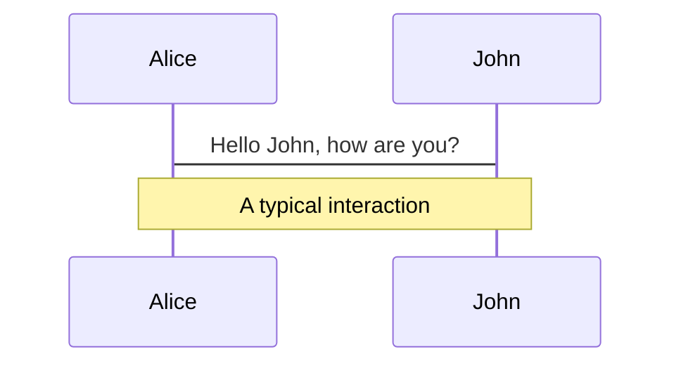
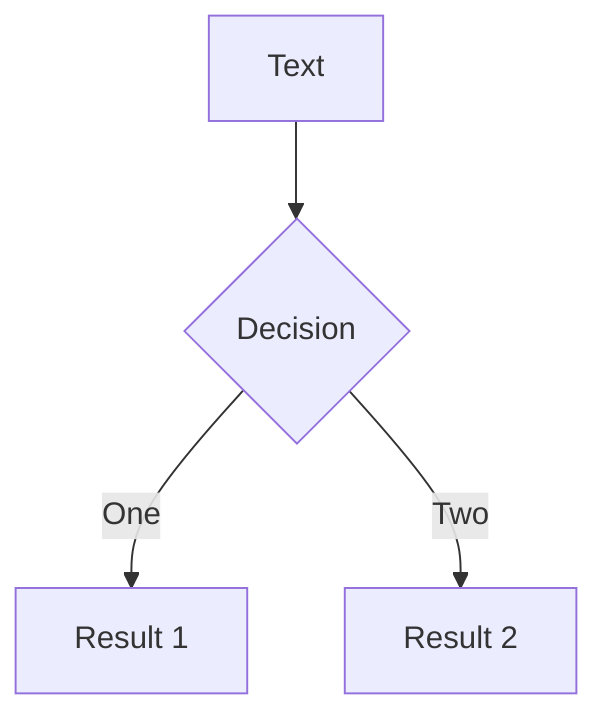
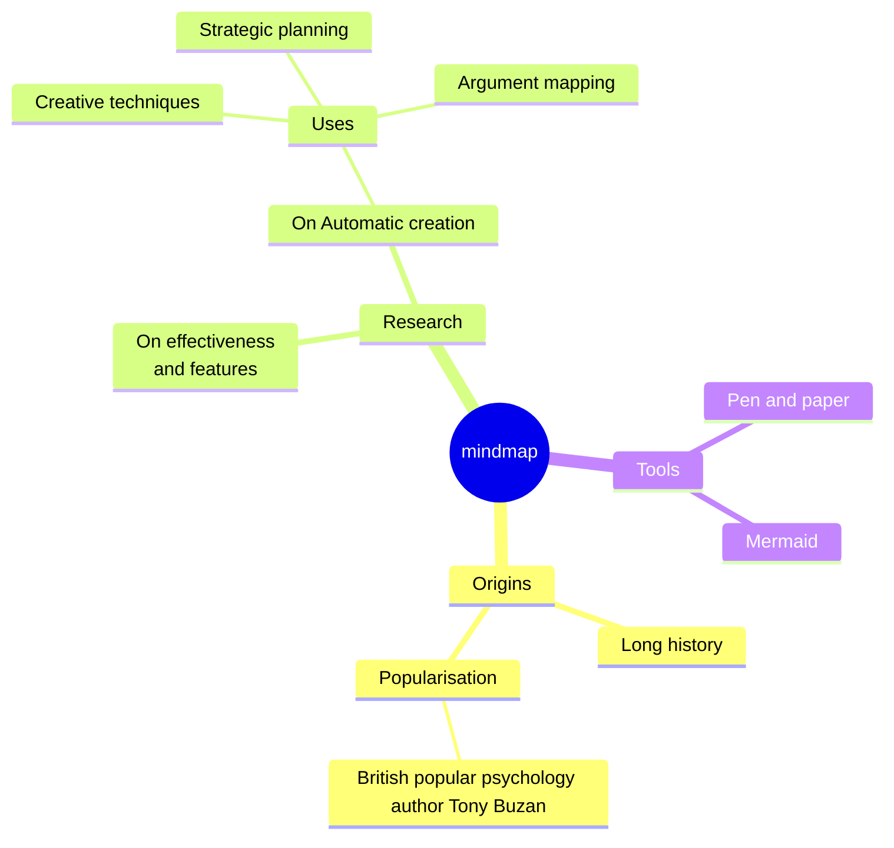
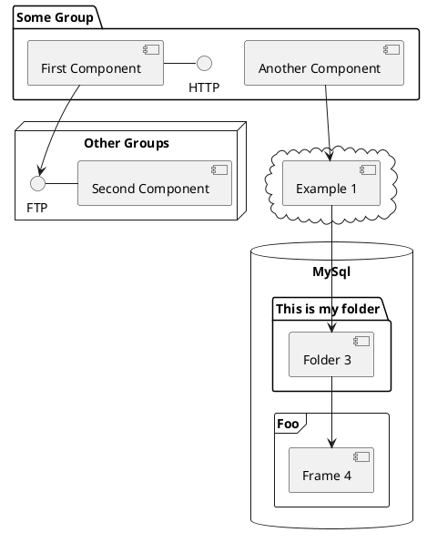

---
# try also 'default' to start simple
theme: default
# random image from a curated Unsplash collection by Anthony
# like them? see https://unsplash.com/collections/94734566/slidev
background: /assets/AdobeStock_263911828.jpeg
# some information about your slides (markdown enabled)
title: Introduction to QGIS - Spring 2026
info: |
  ## Slidev Starter Template
  Presentation slides for developers.

  Learn more at [Sli.dev](https://sli.dev)
# apply UnoCSS classes to the current slide
class: text-center
# https://sli.dev/features/drawing
drawings:
  persist: false
# slide transition: https://sli.dev/guide/animations.html#slide-transitions
transition: slide-left
# enable MDC Syntax: https://sli.dev/features/mdc
mdc: true
# duration of the presentation
duration: 55min
---

# Introduction to QGIS

Open Source Geographic Information System

<div @click="$slidev.nav.next" class="mt-12 py-1" hover:bg="white op-10">
  Press Space for next page <carbon:arrow-right />
</div>

<div class="abs-br m-6 text-xl">
  <button @click="$slidev.nav.openInEditor()" title="Open in Editor" class="slidev-icon-btn">
    <carbon:edit />
  </button>
  <a href="https://github.com/slidevjs/slidev" target="_blank" class="slidev-icon-btn">
    <carbon:logo-github />
  </a>
</div>

<!--
The last comment block of each slide will be treated as slide notes. It will be visible and editable in Presenter Mode along with the slide. [Read more in the docs](https://sli.dev/guide/syntax.html#notes)
-->

---
transition: slide-up
---

# Workshop contents


- 📝 **GIS basic concepts** - spatial data types, layers and overlay, attributes, coordinate systems
- 🎨 **QGIS interface** - 
- 🧑‍💻 **Data Loading** - 
- 🤹 **Hands on exercise** - 
- 💾 **Exporting a map** - 
- 🏁 **Wrap-up** - questions and upcoming workshops
<br>
<br>
<!--
You can have `style` tag in markdown to override the style for the current page.
Learn more: https://sli.dev/features/slide-scope-style
-->
<style>
h1 {
  background-color: #2B90B6;
  background-image: linear-gradient(45deg, #4EC5D4 10%, #146b8c 20%);
  background-size: 100%;
  -webkit-background-clip: text;
  -moz-background-clip: text;
  -webkit-text-fill-color: transparent;
  -moz-text-fill-color: transparent;
}
</style>

---
transition: slide-up
layout: two-cols
---

# What is GIS?

is a computer system that analyzes and displays geographically referenced information. It uses data that is attached to a unique location. (USGS)
<br>
<br>
<br>
<br>

<div v-click>

- 💻 Hardware

</div>

<div v-click>

- 💾 Software

</div>

<div v-click>

- 📊 Data <span v-mark.red="6">*(Location)*</span>

</div>

<div v-click>

- ⚙️ Processes

</div>

<div v-click>

- 👥 <span v-mark.circle.orange="7">People</span>

</div>

::right::

<div class="h-full flex flex-col justify-center">
  
</div>

---
layout: two-cols
layoutClass: gap-16
level: 2
---

# Types of data
<br>

<div class="space-y-6">
  <div class="transform hover:scale-105 transition-transform duration-200">
    <div class="text-2xl font-extrabold text-transparent bg-clip-text bg-gradient-to-r from-blue-600 to-purple-600 mb-2">
      Vector Data
    </div>
    <div class="text-gray-700 ml-4">
      • Points, Lines, Polygons
    </div>
  </div>
  
  <div class="transform hover:scale-105 transition-transform duration-200">
    <div class="text-2xl font-extrabold text-transparent bg-clip-text bg-gradient-to-r from-green-600 to-teal-600 mb-2">
      Raster Data
    </div>
    <div class="text-gray-700 ml-4">
      • Pixel, cell
    </div>
  </div>
</div>

::right::
<div class="h-full flex items-center justify-center">
  
</div>

---
layout: image-right
image: https://upload.wikimedia.org/wikipedia/commons/e/ee/Worlds_animate.gif
level: 2
---

# Coordinate Systems (CRS)
<br>

**Geographic Coordinate System**
- Latitude and Longitude
- Uses angles measured from the Earth's center

**Projected Coordinate System**
- Models the Earth as a plane
- Based on a *map projection*

<!-- Footer -->

[Learn more](https://gistbok-ltb.ucgis.org/page/34/concept/10535)

<!-- Inline style -->
<style>
.footnotes-sep {
  @apply mt-5 opacity-10;
}
.footnotes {
  @apply text-sm opacity-75;
}
.footnote-backref {
  display: none;
}
</style>

---
layout: image
image: https://upload.wikimedia.org/wikipedia/commons/thumb/c/c2/QGIS_logo%2C_2017.svg/2560px-QGIS_logo%2C_2017.svg.png?20170501030013
backgroundSize: contain

---

---
layout: image-right
image: /assets/qgis_intro02.png
backgroundSize: contain
---

## What is QGIS?
is a free, open-source desktop Geographic Information System (GIS) software used to create, edit, visualize, analyze, and publish geospatial data.
<br>
<br>
<br>
<br>
<div class="flex flex-col items-center mt-8 space-y-4">
  
  
  <div class="flex space-x-8">
    
    
  
  </div>
</div>
<!--<div grid="~ cols-2 gap-2" m="t-2">-->


---

# Clicks Animations

You can add `v-click` to elements to add a click animation.

<div v-click>

This shows up when you click the slide:

```html
<div v-click>This shows up when you click the slide.</div>
```

</div>

<br>

<v-click>

The <span v-mark.red="3"><code>v-mark</code> directive</span>
also allows you to add
<span v-mark.circle.orange="4">inline marks</span>
, powered by [Rough Notation](https://roughnotation.com/):

```html
<span v-mark.underline.orange>inline markers</span>
```

</v-click>

<div mt-20 v-click>

[Learn more](https://sli.dev/guide/animations#click-animation)

</div>

---

# Motions

Motion animations are powered by [@vueuse/motion](https://motion.vueuse.org/), triggered by `v-motion` directive.

<div class="w-60 relative">
  <div class="relative w-60 h-60">
    <!-- Microsoft logo - top of triangle -->
    
    
  
    
  
  </div>

  <div
    class="text-5xl absolute top-14 left-40 text-[#2B90B6] -z-1"
    v-motion
    :initial="{ x: 0, opacity: 0}"
    :enter="{ x: 50, opacity: 1, transition: { delay: 2000, duration: 1000 } }">
    Multi platform
  </div>
</div>

<script setup lang="ts">
const microsoftFinal = {
  x: 80,  // center horizontally
  y: 0,   // top of triangle
  rotate: 0,
  scale: 1,
  transition: {
    type: 'spring',
    damping: 10,
    stiffness: 20,
    mass: 2
  }
}

const appleFinal = {
  x: 20,   // left side
  y: 100,  // bottom of triangle
  rotate: 0,
  scale: 1,
  transition: {
    type: 'spring',
    damping: 10,
    stiffness: 20,
    mass: 2
  }
}

const linuxFinal = {
  x: 140,  // right side
  y: 100,  // bottom of triangle
  rotate: 0,
  scale: 1,
  transition: {
    type: 'spring',
    damping: 10,
    stiffness: 20,
    mass: 2
  }
}
</script>


---

# $\LaTeX$

$\LaTeX$ is supported out-of-box. Powered by [$\KaTeX$](https://katex.org/).

<div h-3 />

Inline $\sqrt{3x-1}+(1+x)^2$

Block
$$ {1|3|all}
\begin{aligned}
\nabla \cdot \vec{E} &= \frac{\rho}{\varepsilon_0} \\
\nabla \cdot \vec{B} &= 0 \\
\nabla \times \vec{E} &= -\frac{\partial\vec{B}}{\partial t} \\
\nabla \times \vec{B} &= \mu_0\vec{J} + \mu_0\varepsilon_0\frac{\partial\vec{E}}{\partial t}
\end{aligned}
$$

[Learn more](https://sli.dev/features/latex)

---

# Diagrams

You can create diagrams / graphs from textual descriptions, directly in your Markdown.

<div class="grid grid-cols-4 gap-5 pt-4 -mb-6">









</div>

Learn more: [Mermaid Diagrams](https://sli.dev/features/mermaid) and [PlantUML Diagrams](https://sli.dev/features/plantuml)

---
foo: bar
dragPos:
  square: 691,32,167,_,-16
---

# Draggable Elements

Double-click on the draggable elements to edit their positions.

<br>

###### Directive Usage

```md

```

<br>

###### Component Usage

```md
<v-drag text-3xl>
  <div class="i-carbon:arrow-up" />
  Use the `v-drag` component to have a draggable container!
</v-drag>
```

<v-drag pos="663,206,261,_,-15">
  <div text-center text-3xl border border-main rounded>
    Double-click me!
  </div>
</v-drag>


###### Draggable Arrow

```md
<v-drag-arrow two-way />
```

<v-drag-arrow pos="67,452,253,46" two-way op70 />

---
src: ./pages/imported-slides.md
hide: false
---

---

# Monaco Editor

Slidev provides built-in Monaco Editor support.

Add `{monaco}` to the code block to turn it into an editor:

```ts {monaco}
import { ref } from 'vue'
import { emptyArray } from './external'

const arr = ref(emptyArray(10))
```

Use `{monaco-run}` to create an editor that can execute the code directly in the slide:

```ts {monaco-run}
import { version } from 'vue'
import { emptyArray, sayHello } from './external'

sayHello()
console.log(`vue ${version}`)
console.log(emptyArray<number>(10).reduce(fib => [...fib, fib.at(-1)! + fib.at(-2)!], [1, 1]))
```

---
layout: center
class: text-center
---

# Learn More

[Documentation](https://sli.dev) · [GitHub](https://github.com/slidevjs/slidev) · [Showcases](https://sli.dev/resources/showcases)

<PoweredBySlidev mt-10 />
